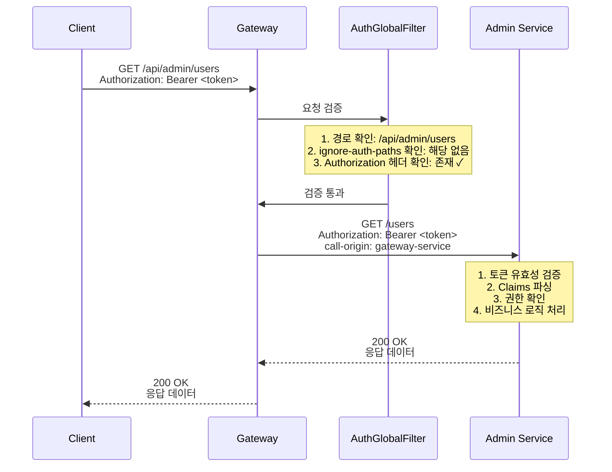
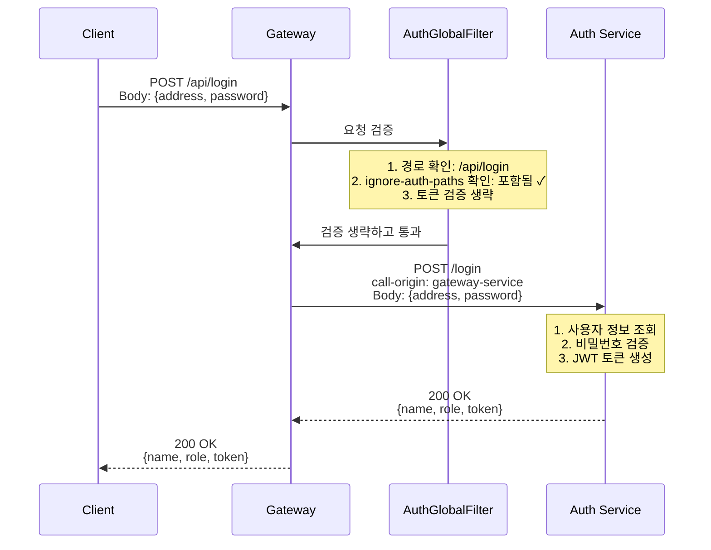
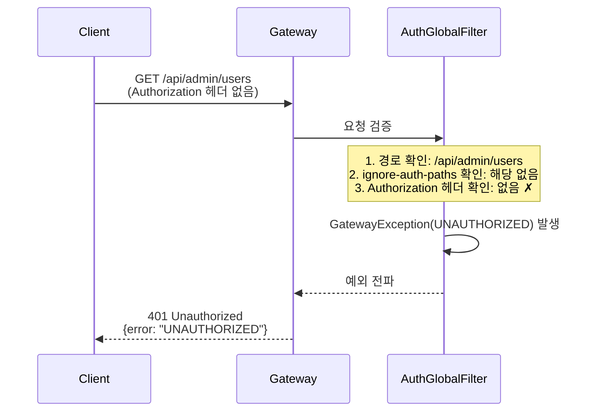

## 목차
1. [Gateway에서의 1차 검증 개요](#1-Gateway에서의-1차-검증-개요)
2. [검증 구조](#2-검증-구조)
3. [주요 구성 요소](#3-주요-구성-요소)
4. [동작 흐름](#4-동작-흐름)
5. [참고 자료](#5-참고-자료)

---

## 1. Gateway에서의 1차 검증 개요

Spring Cloud Gateway를 활용하여 각 마이크로서비스로 라우팅하기 전 JWT 토큰의 존재 여부를 검증하는 방법 구현 예시입니다.

## 2. 검증 구조

```
Client Request
    ↓
Gateway (JWT 토큰 존재 확인)
    ↓
라우팅 필터 적용
    ↓
각 마이크로서비스 (실제 토큰 유효성 검증)
```

## 3. 주요 구성 요소

### TokenProvider - JWT 토큰 생성 및 관리

JWT 토큰의 생성, 추출, 검증을 담당하는 서비스

#### 핵심 기능

- **토큰 생성**: 사용자 정보를 기반으로 JWT 토큰 생성
- **토큰 추출**: HTTP 헤더 또는 쿠키에서 토큰 추출
- **토큰 검증**: 토큰의 유효성 검증 (실제로는 각 서비스에서 수행)

#### 주요 코드

```java
...
public class TokenProvider {
    public static String AUTH_HEADER = "Authorization";
    private static String SUBJECT_TITLE = "your service test";

    // JWT 토큰 생성
    public String createToken(MemberVM memberInfo) {
        Date now = Date.from(Instant.now());
        // 만료기한 : 토큰 생성 일시로부터 2시간 후
        Date expireDate = Date.from(Instant.now().plus(2, ChronoUnit.HOURS));

        Claims claims = Jwts.claims();
        claims.put(Auth.ROLE_KEY, memberInfo.getRole());
        claims.put(Auth.USERNAME_KEY, memberInfo.getName());
        claims.put(Auth.ADDR_KEY, memberInfo.getAddress());

        return Jwts.builder()
                .setSubject(SUBJECT_TITLE)
                .setClaims(claims)
                .signWith(genKey())
                .setIssuer(MAIN_ISSUER)
                .setIssuedAt(now)
                .setExpiration(expireDate)
                .compact();
    }

    // 토큰 존재 여부 확인
    public boolean validateToken(ServerHttpRequest request) {
        String bearerToken = request.getHeaders().getFirst(AUTH_HEADER);
        return bearerToken != null;
    }

    // 토큰 추출 (헤더 또는 쿠키에서)
    // gateway 서비스에선 사용 X, 각 서비스에서 필요한 코드
    public String extractToken(ServerHttpRequest request) {
        String bearerToken = request.getHeaders().getFirst(AUTH_HEADER);
        if (StringUtils.hasText(bearerToken)) {
            if (bearerToken.startsWith("Bearer ")) {
                return bearerToken.substring(7);
            }
            return bearerToken;
        }

        // 쿠키에서 토큰 확인
        MultiValueMap<String, HttpCookie> cookies = request.getCookies();
        // ... 쿠키 처리 로직

        return null;
    }
}
```


### AuthGlobalFilter - JWT 토큰 존재 확인 필터

Gateway에서 라우팅 전 JWT 토큰의 존재 여부만 확인하는 커스텀 필터

#### 핵심 기능

- **토큰 존재 확인**: Authorization 헤더에 토큰이 있는지 확인
- **인증 생략 경로 설정**: 특정 경로는 토큰 검증을 생략 (로그인, 회원가입 등)
- **환경별 설정**: Properties 파일을 통해 환경별로 인증 생략 경로 관리

#### 주요 코드

```java
...
public class AuthGlobalFilter extends AbstractGatewayFilterFactory<AuthGlobalFilter.Config> {
    // application.properties에 작성한 설정 값
    // Application Context Provider로 해당 값 가져옴
    private static String IGNORE_PATH_KEY = "cloud.gateway.ignore-auth-paths";

    public static class Config {
        // 필터에 필요한 추가 설정 정의
        // 테스트 시엔 공백으로
        private List<String> ignorePaths;

        public List<String> getIgnorePaths() {
            return ignorePaths;
        }

        public void setIgnorePaths(List<String> ignorePaths) {
            this.ignorePaths = ignorePaths;
        }
    }

    public AuthGlobalFilter() {
        super(Config.class);
    }

    @Override
    public Config newConfig() {
        // Spring 환경 변수에서 Config에 필요한 값 읽어오기
        Environment env = ApplicationContextProvider.getEnvironment();

        String raw = env.getProperty(IGNORE_PATH_KEY);
        List<String> paths = (raw != null && !raw.isBlank())
                ? Arrays.asList(raw.trim().split(","))
                : List.of();

        Config config = new Config();
        config.setIgnorePaths(paths);
        return config;
    }

    @Override
    public GatewayFilter apply(Config config) {
        return (exchange, chain) -> {
            String path = exchange.getRequest().getURI().getPath();
            List<String> ignorePaths = config.getIgnorePaths();

            // 인증 생략 경로 확인
            if (ignorePaths.stream().anyMatch(path::startsWith)) {
                return chain.filter(exchange);
            }

            // Authorization 헤더에서 토큰 확인
            String token = exchange.getRequest()
                .getHeaders()
                .getFirst(TokenProvider.AUTH_HEADER);

            // 토큰이 없으면 예외 발생
            if (token == null) {
                throw new GatewayException(ErrorCode.UNAUTHORIZED);
            }

            return chain.filter(exchange);
        };
    }
}
```

### RouteConfig - 라우팅 설정 및 필터 적용

마이크로서비스별 라우팅 규칙을 정의하고 AuthGlobalFilter를 적용

이전 게시글의 **RouteConfig**를 수정
- [Spring Cloud Gateway 라우팅 설정하기]() 

#### 핵심 기능

- **라우팅 정의**: 각 서비스별 경로 설정
- **필터 적용**: 인증 필터, Circuit Breaker 등 적용
- **경로 재작성**: URL 패턴 변환

#### 주요 코드

```java
@Configuration
@RequiredArgsConstructor
public class RouteConfig {

    private final AuthGlobalFilter authFilter;

    @Bean
    public RouteLocator gatewayRoutes(RouteLocatorBuilder builder) {
        return builder.routes()
                // 인증이 필요한 경로
                .route("admin-service-auth", r -> r.path(adminServiceAuthPath)
                        .filters(f -> f
                                .addRequestHeader(CALL_ORIGIN_NAME, CALL_ORIGIN_VALUE)
                                .rewritePath(adminRewritePtn, REWRITE_REPLACE_STRING)
                                .filter(authFilter.apply(new AuthGlobalFilter.Config()))
                                .circuitBreaker(c -> c
                                    .setName("adminServiceCircuitBreaker")
                                    .setFallbackUri("forward:/fallback/admin-service")))
                        .uri(adminUri))

                // 인증이 필요 없는 경로
                .route("admin-service", r -> r.path(adminServicePath)
                        .filters(f -> f
                                .addRequestHeader(CALL_ORIGIN_NAME, CALL_ORIGIN_VALUE)
                                .rewritePath(adminRewritePtn, REWRITE_REPLACE_STRING)
                                .circuitBreaker(c -> c
                                    .setName("adminServiceCircuitBreaker")
                                    .setFallbackUri("forward:/fallback/admin-service")))
                        .uri(adminUri))
                .build();
    }
}
```

## 4. 동작 흐름

### 1. 인증이 필요한 요청



**설명:**
1. 클라이언트가 Authorization 헤더에 JWT 토큰을 포함하여 요청
2. AuthGlobalFilter가 토큰의 존재 여부만 확인
3. Gateway가 요청을 Admin Service로 라우팅
4. Admin Service에서 실제 토큰 유효성 검증 및 비즈니스 로직 수행

---

### 2. 인증이 생략되는 요청



**설명:**
1. 클라이언트가 로그인 요청 (토큰 없이)
2. AuthGlobalFilter가 `/api/login` 경로를 ignore-auth-paths에서 확인
3. 토큰 검증을 생략하고 Auth Service로 라우팅
4. Auth Service에서 사용자 인증 후 JWT 토큰 생성 및 반환

---

### 3. 인증 실패 케이스



**설명:**
1. 클라이언트가 토큰 없이 인증이 필요한 경로 요청
2. AuthGlobalFilter가 Authorization 헤더가 없음을 감지
3. GatewayException(UNAUTHORIZED) 발생
4. 클라이언트에게 401 Unauthorized 응답 반환

## 5. 참고 자료

- [Spring Cloud Gateway - Official Documentation](https://spring.io/projects/spring-cloud-gateway)
- [Spring Cloud Gateway Reference Guide](https://docs.spring.io/spring-cloud-gateway/docs/current/reference/html/)
- [Spring Security WebFlux](https://docs.spring.io/spring-security/reference/reactive/index.html)
- [Project Reactor - Core Documentation](https://projectreactor.io/docs/core/release/reference/)
- [GatewayFilter Factories](https://docs.spring.io/spring-cloud-gateway/docs/current/reference/html/#gatewayfilter-factories)
- [Global Filters](https://docs.spring.io/spring-cloud-gateway/docs/current/reference/html/#global-filters)
- [Custom Filter Development Guide](https://docs.spring.io/spring-cloud-gateway/docs/current/reference/html/#writing-custom-gatewayfilter-factories)
- [Spring Cloud Gateway Pattern](https://www.baeldung.com/spring-cloud-gateway-pattern)