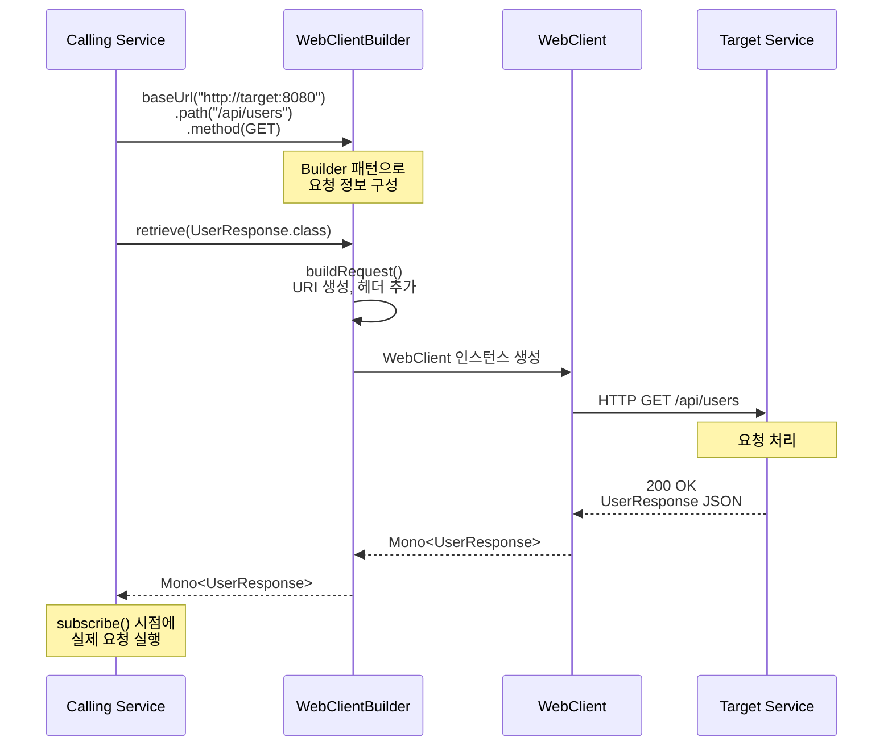
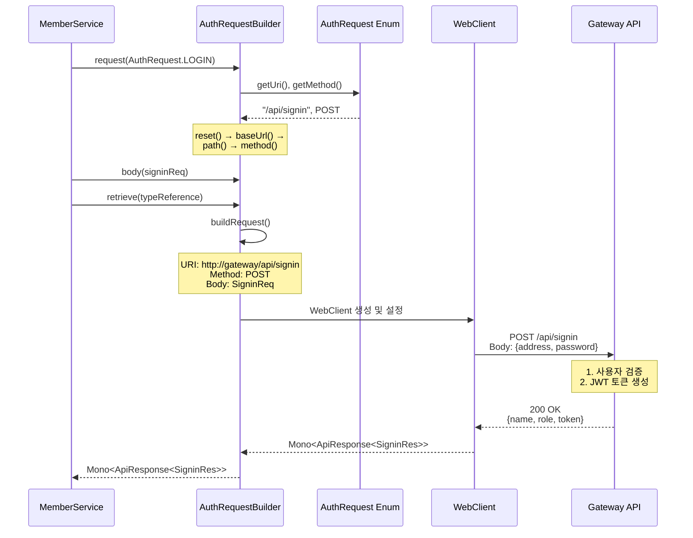
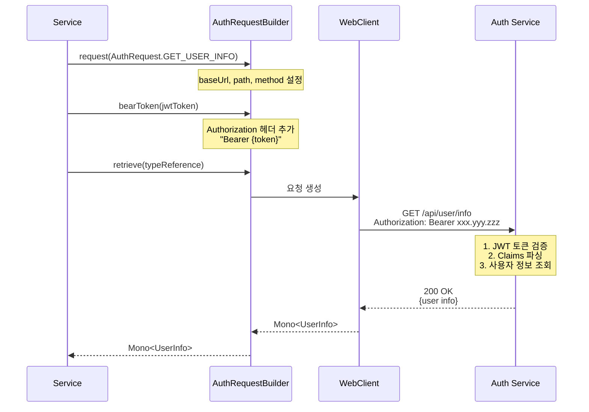

## 목차
1. [개요](#1-개요)
2. [아키텍처 구조](#2-아키텍처-구조)
3. [WebClient vs RestTemplate](#3-webclient-vs-resttemplate)
4. [주요 구성 요소](#4-주요-구성-요소)
5. [동작 흐름](#5-동작-흐름)
6. [참고 자료](#6-참고-자료)

---

## 1. 개요

Spring Cloud 기반 MSA(Microservices Architecture) 프로젝트에서 서비스 간 HTTP 통신을 위해 WebClient를 사용하는 방법과 Builder 패턴을 활용한 효율적인 구현 방법을 정리했습니다.

## 2. 아키텍처 구조

```
Gateway Service
    ↓
WebClientBuilder (Builder Pattern)
    ↓
AuthRequestBuilder (상속 & 확장)
    ↓
WebClient (Spring WebFlux)
    ↓
다른 마이크로서비스 (Admin, User, Auth...)
```

## 3. WebClient vs RestTemplate

### RestTemplate의 한계

RestTemplate은 Spring에서 오랫동안 사용되어 온 <span style="color: red">**동기식 HTTP 클라이언트**</span>입니다.

#### RestTemplate 특징

- **동기(Synchronous) 처리**: 요청을 보내고 응답을 받을 때까지 스레드가 블로킹됨
- **스레드 기반**: 각 요청마다 별도의 스레드 필요
- **확장성 제한**: 많은 동시 요청 처리 시 스레드 풀 고갈 위험
- **유지보수 모드**: Spring 5.0부터 유지보수 모드로 전환

### WebClient의 장점

WebClient는 Spring WebFlux의 일부로, <span style="color: red">**비동기 및 논블로킹 방식의 HTTP 클라이언트**</span>입니다.

#### WebClient 특징

- **비동기(Asynchronous) 처리**: 논블로킹 방식으로 높은 처리량
- **리액티브 스트림**: Mono, Flux를 통한 반응형 프로그래밍
- **적은 리소스**: 소수의 스레드로 많은 요청 처리 가능
- **함수형 API**: 체이닝 방식의 직관적인 API
- **Spring 권장사항**: Spring 5.0 이후 공식 권장

### 성능 비교

| 항목 | RestTemplate | WebClient |
|------|--------------|-----------|
| 처리 방식 | 동기 (Blocking) | 비동기 (Non-blocking) |
| 스레드 사용 | 요청당 1 스레드 | 이벤트 루프 기반 |
| 동시 요청 처리 | 제한적 (스레드 풀 크기) | 우수 (적은 스레드로 많은 요청) |
| 메모리 사용 | 높음 | 낮음 |
| 반응형 프로그래밍 | 미지원 | 완벽 지원 (Mono, Flux) |
| Spring 지원 | 유지보수 모드 | 적극 개발 및 지원 |

## 4. 주요 구성 요소

### 1. WebClientConfig - WebClient 기본 설정

WebClient.Builder를 Spring Bean으로 등록하여 전역에서 사용 가능하도록 설정

#### 핵심 기능

- **기본 헤더 설정**: Content-Type을 JSON으로 설정
- **빌더 패턴**: WebClient.Builder를 Bean으로 제공
- **재사용 가능**: 여러 컴포넌트에서 동일한 설정 공유

#### 주요 코드

```java
@Configuration
public class WebClientConfig {

    @Bean
    public WebClient.Builder webClientBuilder() {
        return WebClient.builder()
                .defaultHeader(HttpHeaders.CONTENT_TYPE, MediaType.APPLICATION_JSON_VALUE);
    }
}
```
---

### 2. WebClientBuilder - 범용 HTTP 요청 빌더

Builder 패턴을 활용하여 유연하고 가독성 높은 HTTP 요청을 구성

#### 핵심 기능

- **Builder 패턴**: 메서드 체이닝으로 직관적인 요청 구성
- **유연한 설정**: URL, 헤더, 쿼리 파라미터, Path Variable 등 동적 설정
- **타입 안전성**: 제네릭을 활용한 타입 안전한 응답 처리
- **재사용성**: reset() 메서드로 빌더 재사용 가능

#### 주요 코드

```java
@Component
@RequiredArgsConstructor
public class WebClientBuilder {

    private final WebClient.Builder webClientBuilder;

    private String baseUrl;
    private String path;
    private HttpMethod method;
    private Object body;
    private Map<String, String> headers = new HashMap<>();
    private Map<String, String> queryParams = new HashMap<>();
    private Map<String, String> pathVariables = new HashMap<>();

    ...

    // HTTP 메서드 설정(예시)
    public WebClientBuilder method(HttpMethod method) {
        this.method = method;
        return this;
    }

    ...

    // Mono 단일 객체 응답
    public <T> Mono<T> retrieve(Class<T> responseType) {
        return buildRequest()
                .retrieve()
                .bodyToMono(responseType);
    }

    // 제네릭 타입 응답
    public <T> Mono<T> retrieve(ParameterizedTypeReference<T> typeReference) {
        return buildRequest()
                .retrieve()
                .bodyToMono(typeReference);
    }

    ..

    private String buildUri() {
        String uri = path;

        // Path Variable 처리 (예: /users/{id} -> /users/123)
        for (Map.Entry<String, String> entry : pathVariables.entrySet()) {
            uri = uri.replace("{" + entry.getKey() + "}", entry.getValue());
        }

        // Query Param 처리 (예: ?page=1&size=10)
        if (!queryParams.isEmpty()) {
            StringBuilder queryString = new StringBuilder("?");
            queryParams.forEach((key, value) ->
                queryString.append(key).append("=").append(value).append("&")
            );
            uri += queryString.substring(0, queryString.length() - 1);
        }

        return uri;
    }
}
```
---

### 3. AuthRequestBuilder - 인증 서비스 전용 빌더

WebClientBuilder를 상속받아 인증 관련 요청에 특화된 기능을 제공

#### 핵심 기능

- **WebClientBuilder 상속**: 기본 기능 재사용
- **Enum 기반 요청 정의**: AuthRequest Enum으로 API 엔드포인트 관리
- **Bearer Token 지원**: JWT 토큰 헤더 자동 추가
- **타입 안전성**: 컴파일 타임에 API 엔드포인트 검증

#### 주요 코드

```java
@Component
public class AuthRequestBuilder extends WebClientBuilder {

    public AuthRequestBuilder(WebClient.Builder webClientBuilder) {
        super(webClientBuilder);
    }

    /**
     * AuthRequest Enum을 사용한 요청 초기화
     */
    public AuthRequestBuilder request(AuthRequest authRequest) {
        return (AuthRequestBuilder) this
                .reset()
                .baseUrl(Const.GATEWAY_SERVICE_ADDR)
                .path(authRequest.getUri())
                .method(authRequest.getMethod());
    }

    /**
     * Bearer Token 헤더 추가
     */
    public AuthRequestBuilder bearToken(String token) {
        return (AuthRequestBuilder) this.header(
            TokenProvider.AUTH_HEADER,
            "Bearer " + token
        );
    }
}
```
---

### 4. AuthRequest Enum - API 엔드포인트 정의

인증 관련 API 엔드포인트를 Enum으로 정의한 클래스

#### 주요 코드

```java
@Getter
public enum AuthRequest {
    LOGIN(HttpMethod.POST, "/api/signin"),
    SIGNUP(HttpMethod.POST, "/api/signup");

    private final HttpMethod method;
    private final String uri;

    AuthRequest(HttpMethod method, String uri) {
        this.method = method;
        this.uri = uri;
    }
}
```

**장점:**
- **타입 안전성**: 컴파일 타임에 잘못된 엔드포인트 사용 방지
- **중앙 관리**: API 엔드포인트 변경 시 한 곳에서 수정
- **자동 완성**: IDE의 자동 완성 기능 활용 가능

---

### 5. 사용 예시

```java
@Service
@RequiredArgsConstructor
public class MemberService {
    private final AuthRequestBuilder authRequestBuilder;

    /**
     * 인증 서비스의 login API 호출(현재 gateway 서비스에 구현함)
     */
    public Mono<ApiResponse<SigninRes>> loginCall(SigninReq reqDto) {
        return authRequestBuilder
                .request(AuthRequest.LOGIN)  // Enum으로 엔드포인트 선택
                .body(reqDto)
                .retrieve(new ParameterizedTypeReference<ApiResponse<SigninRes>>() {});
    }
}
```
---

## 5. 동작 흐름

### 1. 서비스 간 일반 호출



**설명:**
1. Calling Service에서 WebClientBuilder로 요청 정보 설정
2. Builder 패턴으로 메서드 체이닝하여 가독성 높은 코드 작성
3. retrieve() 호출 시 WebClient 인스턴스 생성 및 요청 구성
4. Target Service로 HTTP 요청 전송
5. Mono로 감싸진 응답 반환 (지연 실행)

---

### 2. AuthRequestBuilder를 사용한 인증 요청



**설명:**
1. MemberService에서 AuthRequestBuilder의 request() 메서드 호출
2. AuthRequest Enum에서 엔드포인트 정보 조회
3. Builder 내부에서 reset() 후 baseUrl, path, method 자동 설정
4. body()로 요청 본문 추가
5. retrieve()로 타입 안전한 응답 처리
6. Gateway API로 실제 요청 전송

---

### 3. Bearer Token을 포함한 인증 요청



**설명:**
1. request()로 기본 요청 정보 설정
2. bearToken()으로 JWT 토큰을 Authorization 헤더에 자동 추가
3. Auth Service에서 토큰 검증 및 사용자 정보 반환

---

## 6. 참고 자료

- [Spring WebClient Documentation](https://docs.spring.io/spring-framework/reference/web/webflux-webclient.html)
- [Spring WebFlux](https://docs.spring.io/spring-framework/reference/web/webflux.html)
- [Project Reactor](https://projectreactor.io/docs/core/release/reference/)
- [Reactor Netty](https://projectreactor.io/docs/netty/release/reference/index.html)
- [Spring Blog - WebClient vs RestTemplate](https://spring.io/blog/2021/09/02/a-new-era-of-spring-cloud-commons)
- [Baeldung - Spring WebClient vs RestTemplate](https://www.baeldung.com/spring-webclient-resttemplate)
- [Spring WebClient Guide](https://www.baeldung.com/spring-5-webclient)
- [Baeldung - Spring WebClient](https://www.baeldung.com/spring-5-webclient)
- [Baeldung - Builder Pattern in Java](https://www.baeldung.com/creational-design-patterns#builder)