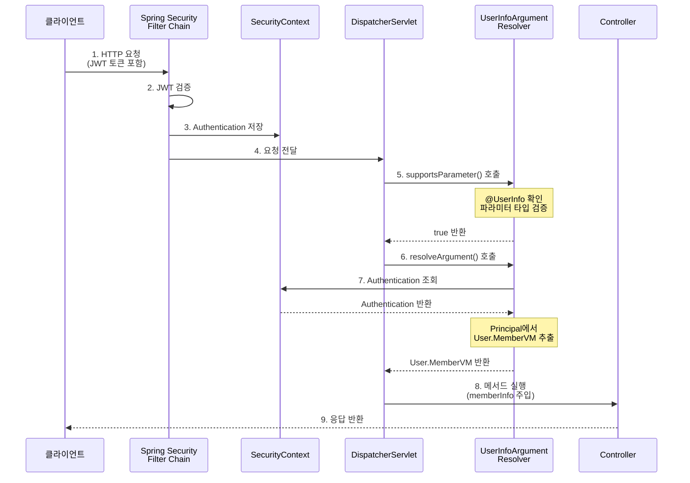

## 목차
1. [개요](#1-개요)
2. [구성 요소](#2-구성-요소)
3. [동작 원리](#3-동작-원리)
4. [참고 자료](#4-참고-자료)

---

## 1. 개요

Spring Security의 `@AuthenticationPrincipal`을 대체하는 커스텀 인증 어노테이션을 구현하여, 인증된 사용자 정보를 컨트롤러 메서드에서 간편하게 주입받을 수 있도록 구성했습니다.

---

## 2. 구성 요소

### 1. @UserInfo 어노테이션(Custom Auth 어노테이션 제작)

```java
@Target(ElementType.PARAMETER)
@Retention(RetentionPolicy.RUNTIME)
@Hidden
@Documented
public @interface UserInfo {
}
```

**주요 특징**:

- `@Target(ElementType.PARAMETER)`: 메서드 파라미터에만 적용 가능
- `@Retention(RetentionPolicy.RUNTIME)`: 런타임에 리플렉션으로 접근 가능
- `@Hidden`: Swagger 문서에서 숨김 처리
- `@Documented`: JavaDoc에 포함

---

### 2. UserInfoArgumentResolver

Spring MVC의 `HandlerMethodArgumentResolver` 인터페이스를 구현하여 커스텀 어노테이션이 적용된 파라미터를 자동으로 해석하고 주입

#### 주요 메서드

##### supportsParameter()

```java
public boolean supportsParameter(MethodParameter parameter) {
    return checkParameter(parameter);
}
```

- `@UserInfo` 어노테이션이 적용된 파라미터를 지원할지 판단

##### resolveArgument()

```java
public Object resolveArgument(MethodParameter parameter, ...) {
    // 1. @UserInfo 어노테이션 존재 여부 체크
    if(!checkParameter(parameter)){
        throw new CustomException(ErrorCode.METHOD_NOT_ALLOWED, "Invalid Annotation...");
    }

    // 2. SecurityContext에서 인증 정보 추출
    Authentication auth = SecurityContextHolder.getContext().getAuthentication();
    if(auth == null || !auth.isAuthenticated()) {
        throw new CustomException(ErrorCode.UNAUTHORIZED);
    }

    // 3. Principal에서 사용자 정보 추출 (JWT의 경우)
    Object principal = auth.getPrincipal();

    if(principal instanceof User.MemberVM memberVm) {
        return memberVm;
    }

    throw new CustomException(ErrorCode.UNAUTHORIZED);
}
```

**처리 흐름**:

1. 어노테이션 유효성 검증
2. SecurityContextHolder에서 Authentication 객체 확인
3. 인증 여부 검증
4. Principal에서 `User.MemberVM` 타입 추출
5. 실패 시 `CustomException(UNAUTHORIZED)` 발생

##### checkParameter()

```java
private boolean checkParameter(MethodParameter parameter) {
    UserInfo userInfoAnnotation = parameter.getParameterAnnotation(UserInfo.class);
    boolean hasAnnotation = userInfoAnnotation != null;

    boolean isCorrectType = User.MemberVM.class.isAssignableFrom(parameter.getParameterType());

    return hasAnnotation && isCorrectType;
}
```

**검증 조건**:

- `@UserInfo` 어노테이션이 존재하는지 확인
- 파라미터 타입이 `User.MemberVM` 타입인지 확인
- 두 조건을 모두 만족해야 true 반환

---

### 3. WebMvcConfig 설정

```java
@Configuration
@RequiredArgsConstructor
public class WebMvcConfig implements WebMvcConfigurer {
    private final UserInfoArgumentResolver userInfoArgumentResolver;

    @Override
    public void addArgumentResolvers(List<HandlerMethodArgumentResolver> resolvers) {
        resolvers.add(userInfoArgumentResolver);
    }
}
```

**역할**:

- `UserInfoArgumentResolver`를 Spring MVC의 ArgumentResolver 목록에 등록
- 의존성 주입을 통해 `@Component`로 등록된 resolver 사용

---

### 4. Controller에서 사용 예시

#### @AuthenticationPrincipal 사용 (기존 방식)

```java
@GetMapping("/member")
public ResponseEntity<CustomResponse<String>> getMethodName(
    @AuthenticationPrincipal User.MemberVM memberInfo) {
    String name = memberInfo.getName();
    CustomResponse<String> res = new CustomResponse<String>(true, null, name);
    return ResponseEntity.ok(res);
}
```

#### @UserInfo 사용 (커스텀 방식)

```java
@GetMapping("/memberInfo")
public ResponseEntity<CustomResponse<String>> getUserInfo(
    HttpServletRequest request,
    HttpServletResponse response,
    @UserInfo User.MemberVM memberInfo) {
    String name = memberInfo.getName();
    CustomResponse<String> res = new CustomResponse<String>(true, null, name);
    return ResponseEntity.ok(res);
}
```

---

## 3. 동작 원리



## 4. 참고 자료

- [Spring MVC - HandlerMethodArgumentResolver 공식 문서](https://docs.spring.io/spring-framework/docs/current/javadoc-api/org/springframework/web/method/support/HandlerMethodArgumentResolver.html)
- [Spring Security - @AuthenticationPrincipal](https://docs.spring.io/spring-security/reference/servlet/integrations/mvc.html#mvc-authentication-principal)
- [Custom Annotations in Spring](https://www.baeldung.com/spring-mvc-custom-annotation)