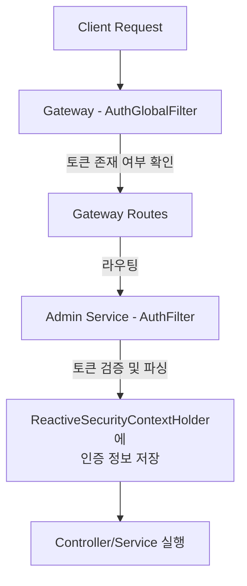
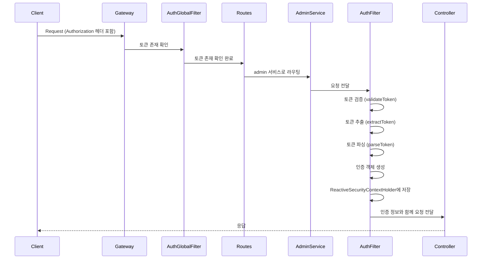

## 목차
1. [개요](#1-개요)
2. [Spring WebFlux Security 설정](#2-spring-webflux-security-설정)
3. [Gateway → Service 라우팅 및 AuthFilter 흐름](#3-gateway--service-라우팅-및-authfilter-흐름)
4. [보안 설정 요약](#4-보안-설정-요약)
5. [참고 자료](#5-참고-자료)

---

## 1. 개요

MSA 프로젝트에서 Spring WebFlux 기반의 Security 설정을 다룹니다. Gateway를 통해 라우팅된 요청이 각 서비스의 인증 필터를 거치는 과정과 WebFlux의 특성을 중심으로 설명합니다.

---

## 2. Spring WebFlux Security 설정

### 2.1 AdminSecurityConfig 구성

Spring WebFlux에서는 기존 Spring MVC의 `HttpSecurity` 대신 `ServerHttpSecurity`를 사용하여 보안을 설정합니다.

```java
@Configuration
@EnableReactiveMethodSecurity
@EnableWebFluxSecurity
@RequiredArgsConstructor
@Import(SecurityProblemSupport.class) // zalando의 problem을 활용한 Security Exception 처리를 위한 의존성(선택 사항)
public class AdminSecurityConfig {

    private final AuthFilter authFilter;

    // Cors 설정 구현
    @Bean
    public CorsConfigurationSource corsConfigurationSource() {...}

    // Security 설정 구현
    @Bean
    public SecurityWebFilterChain securityWebFilterChain(ServerHttpSecurity http)throws Exception {
        return http.csrf(ServerHttpSecurity.CsrfSpec::disable)
                .formLogin(ServerHttpSecurity.FormLoginSpec::disable)
                .httpBasic(ServerHttpSecurity.HttpBasicSpec::disable)
                .cors(cors -> cors.configurationSource(corsConfigurationSource()))
                .authorizeExchange(requests -> requests
                    ...
                    .pathMatchers(...).permitAll()
                    .anyExchange().authenticated())
                .addFilterAt(authFilter, SecurityWebFiltersOrder.AUTHORIZATION)
                ...
                .build();
    }
}
```

**주요 설정 내용:**

- **CSRF/Form Login/HTTP Basic 비활성화**: JWT 기반 인증을 사용하므로 불필요한 기능 제거
- **CORS 설정**: `CorsConfigurationSource`를 통한 교차 출처 리소스 공유 허용
- **경로별 권한 설정**: `authorizeExchange()` 메서드로 공개/보호 경로 구분
- **Custom Filter 추가**: `AuthFilter`를 `SecurityWebFiltersOrder.AUTHORIZATION` 위치에 추가

---

### 2.2 ReactiveSecurityContextHolder의 중요성

**기존 Spring MVC와의 차이점:**

| 항목 | Spring MVC | Spring WebFlux |
|------|-----------|----------------|
| Security Context | `SecurityContextHolder` (ThreadLocal 기반) | `ReactiveSecurityContextHolder` (Reactor Context 기반) |
| 저장 방식 | Thread-bound | Context propagation |
| 비동기 처리 | ThreadLocal로 인한 제약 | 리액티브 체인 전체에서 접근 가능 |

**ReactiveSecurityContextHolder 사용 예시:**

```java
@Slf4j
@Component
@RequiredArgsConstructor
public class AuthFilter implements WebFilter {
    @Override
    public Mono<Void> filter(ServerWebExchange exchange, WebFilterChain chain) {
        // 1. 비동기적으로 토큰 검증
        // 2. 검증 결과를 기반으로 분기
        // 3. Context에 인증 정보 전파
        // 4. 다음 필터로 체인 전달
        ...
        Authentication authentication = new UsernamePasswordAuthenticationToken(
            memberInfo,
            null,
            Collections.singletonList(new SimpleGrantedAuthority("ROLE_" + memberInfo.getRoleName()))
        );

        return chain.filter(exchange)
            .contextWrite(ReactiveSecurityContextHolder.withAuthentication(authentication));
    }
}
```

---

## 3. Gateway → Service 라우팅 및 AuthFilter 흐름

### 3.1 전체 흐름도



### 3.2 Gateway의 AuthGlobalFilter

Gateway는 **토큰의 존재 여부만 확인**하고, 실제 검증은 각 서비스에 위임합니다.

**주요 역할:**
- Authorization 헤더에 토큰이 있는지 확인
- 공개 경로(ignore-auth-paths)는 토큰 검사 생략
- 토큰이 없으면 `UNAUTHORIZED` 예외 발생

```java
// Gateway의 AuthGlobalFilter 핵심 로직
@Override
public GatewayFilter apply(Config config) {
    return (exchange, chain) -> {
        String path = exchange.getRequest().getURI().getPath();
        List<String> ignorePaths = config.getIgnorePaths();

        if (ignorePaths != null && ignorePaths.stream().anyMatch(path::startsWith)) {
            return chain.filter(exchange); // 인증 생략
        }

        String token = exchange.getRequest().getHeaders().getFirst(TokenProvider.AUTH_HEADER);

        if (token == null) {
            throw new GatewayException(ErrorCode.UNAUTHORIZED);
        }
        return chain.filter(exchange);
    };
}
```

---

### 3.3 Admin Service의 AuthFilter

라우팅된 후 각 서비스에서는 **실제 JWT 토큰 검증과 사용자 정보 추출**을 수행합니다.

**AuthFilter 처리 단계:**

1. **공개 경로 확인**:  공개 경로 확인 후 통과(예시: `/swagger`, `/api-docs`, `/api/login`)
2. **토큰 유효성 검증**: `TokenManager.validateToken()`으로 토큰 존재 확인
3. **토큰 추출**: Header 또는 Cookie에서 JWT 토큰 추출
4. **토큰 파싱**: JWT 서명 검증 및 Claims 추출
5. **인증 객체 생성**: `UsernamePasswordAuthenticationToken` 생성
6. **Context에 저장**: `ReactiveSecurityContextHolder.withAuthentication()` 사용

```java
@Override
public Mono<Void> filter(ServerWebExchange exchange, WebFilterChain chain) {
    return Mono.defer(() -> {
        try {
            ServerHttpRequest request = exchange.getRequest();
            String path = request.getPath().value();

            // 1. 공개 경로는 인증 없이 통과
            if (isPublicPath(path)) {
                return chain.filter(exchange);
            }

            // 2. 토큰 유효성 검사
            if (!tokenManager.validateToken(request)) {
                return Mono.error(new AdminException(ErrorCode.UNAUTHORIZED));
            }

            // 3. 토큰 추출
            String token = tokenManager.extractToken(request);

            // 4. 토큰 파싱 및 회원 정보 추출
            MemberVM memberInfo = tokenManager.parseToken(token);

            // 5. Spring Security Authentication 객체 생성
            Authentication authentication = new UsernamePasswordAuthenticationToken(
                memberInfo,
                null,
                Collections.singletonList(new SimpleGrantedAuthority("ROLE_" + memberInfo.getRoleName()))
            );

            // 6. ReactiveSecurityContextHolder에 인증 정보 저장
            return chain.filter(exchange)
                .contextWrite(ReactiveSecurityContextHolder.withAuthentication(authentication));

        } catch (Exception e) {
            return Mono.error(new AdminException(ErrorCode.UNAUTHORIZED));
        }
    });
}
```

---

### 3.4 TokenManager의 역할

TokenManager는 JWT 토큰 처리를 담당합니다:

- **validateToken()**: Request에 토큰이 포함되어 있는지 확인 (Header 또는 Cookie)
- **extractToken()**: Bearer 토큰 또는 Cookie에서 실제 JWT 문자열 추출
- **parseToken()**: JWT 서명 검증 및 Claims에서 사용자 정보 추출

```java
public MemberVM parseToken(String token) {
    try {
        Claims claims = Jwts.parserBuilder()
            .setSigningKey(genKey())
            .build()
            .parseClaimsJws(token)
            .getBody();

        String issuer = claims.getIssuer();

        // issuer가 유효하지 않으면 null 반환
        if (!MAIN_ISSUER.equals(issuer)) {
            return null;
        }

        // 유효한 토큰이면 회원 정보 생성
        MemberVM memberInfo = new MemberVM();
        memberInfo.setAddress(claims.get(Auth.ADDR_KEY, String.class));
        memberInfo.setName(claims.get(Auth.USERNAME_KEY, String.class));
        memberInfo.setRole(claims.get(Auth.ROLE_KEY, Integer.class));

        return memberInfo;
    } catch (Exception e) {
        return null;
    }
}
```

---

## 4. 보안 설정 요약

### 4.1 Gateway와 Service의 역할 분리

| 계층 | 역할 | 검증 수준 |
|------|------|----------|
| **Gateway** | 토큰 존재 여부 확인 | Lightweight 검증 |
| **Service** | JWT 서명 검증 및 Claims 파싱 | Full 검증 |

### 4.2 주요 구성 요소

1. **AdminSecurityConfig**: WebFlux Security 전체 설정
2. **AuthFilter**: JWT 기반 인증 필터 (WebFilter 구현)
3. **TokenManager**: JWT 토큰 검증 및 파싱
4. **ReactiveSecurityContextHolder**: 인증 정보 저장 및 전파
5. **SecurityProblemSupport**: 인증/인가 예외 처리

### 4.3 인증 흐름 정리



---

## 5. 참고 자료

- [Spring Security Reference - WebFlux Security](https://docs.spring.io/spring-security/reference/reactive/index.html)
- [Reactive Applications - Security](https://docs.spring.io/spring-security/reference/reactive/getting-started.html)
- [ReactiveSecurityContextHolder API](https://docs.spring.io/spring-security/site/docs/current/api/org/springframework/security/core/context/ReactiveSecurityContextHolder.html)
- [Spring Cloud Gateway Documentation](https://docs.spring.io/spring-cloud-gateway/reference/index.html)
- [Global Filters](https://docs.spring.io/spring-cloud-gateway/reference/spring-cloud-gateway/global-filters.html)
- [GatewayFilter Factories](https://docs.spring.io/spring-cloud-gateway/reference/spring-cloud-gateway/gatewayfilter-factories.html)
- [JWT.io - JSON Web Tokens Introduction](https://jwt.io/introduction)
- [Spring WebFlux Documentation](https://docs.spring.io/spring-framework/reference/web/webflux.html)
- [Reactive Programming with Spring WebFlux](https://spring.io/guides/gs/reactive-rest-service)
- [WebFilter in Spring WebFlux](https://docs.spring.io/spring-framework/docs/current/javadoc-api/org/springframework/web/server/WebFilter.html)
- [Token-based Authentication in Microservices](https://www.baeldung.com/spring-security-oauth-jwt)