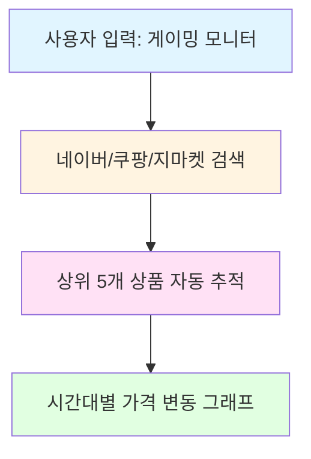

## 📋 목차

- [프로젝트 소개](#-프로젝트-소개)
- [주요 기능](#-주요-기능)
- [기술 스택](#-기술-스택)
- [시스템 아키텍처](#-시스템-아키텍처)
- [개발 로드맵](#-개발-로드맵)

---

## 🎯 프로젝트 소개

### 배경

Claude AI Pro 요금제를 사용 중이고 사이드 프로젝트를 진행한지 오랜 시간이 지나 AI를 활용한 프로젝트의 진행이 필요하다 생각했다.
 
주제를 생각하던 중 ***"AI를 활용하면 온라인 쇼핑에서 **최적의 구매 시점**을 찾을 수 있을까?"*** 
 
라는 생각을 하게되어 프로젝트 주제로 선정했다.
 

### 차별화 포인트

1. **키워드 기반 모니터링**: 특정 상품 URL이 아닌 키워드로 여러 상품을 동시에 추적
2. **멀티 플랫폼 통합**: 네이버, 쿠팡, 지마켓을 한 번에 검색하여 최저가 자동 발견
3. **AI 가격 분석**: Claude API를 활용한 가격 트렌드 예측 및 구매 전략 제안
4. **학습 목적 최적화**: Oracle Cloud ARM 무료 티어를 활용한 비용 효율적 인프라

### 프로젝트 목표

- [ ] Spring Boot 백엔드 개발 역량 강화
- [ ] AI API 연동 경험 습득
- [ ] 대용량 시계열 데이터 처리 경험
- [ ] 클라우드 인프라 운영 경험
- [ ] 실제 사용자에게 가치를 제공하는 서비스 구축

 

## ✨ 주요 기능

### 1. 키워드 기반 모니터링

- 키워드 하나로 여러 상품 동시 모니터링
- 플랫폼별 또는 전체 플랫폼 통합 검색
- 1시간 주기 자동 크롤링

### 2. 스마트 알림

- **목표가 도달 알림**: 설정한 가격 이하로 떨어지면 즉시 알림
- **가격 하락 알림**: 이전 크롤링 대비 가격이 떨어진 경우 알림
- **중복 방지**: 1시간 내 동일 상품 중복 알림 차단

### 3. AI 가격 분석 (예정)

- Claude API 기반 가격 트렌드 분석
- 최적 구매 시점 추천
- 경쟁 상품 비교 분석

### 4. 데이터 시각화 (예정)

- 시간대별 가격 변동 그래프
- 플랫폼별 가격 비교 차트
- 최저가 상품 하이라이트

 

## 🛠 기술 스택

| 카테고리 | 항목 | 기술/도구 |
|---------|------|----------|
| **Backend** | Framework | Spring Boot 3.x |
| | Language | Java 21 |
| | Build Tool | Gradle |
| | ORM | Spring Data JPA |
| | Database | PostgreSQL 15 |
| **Crawling** | Library | Jsoup (HTML 파싱) |
| | Scheduler | Spring Scheduler |
| **AI Integration** | API | Anthropic Claude API (Sonnet 4) |
| | Use Cases | 가격 트렌드 분석, 구매 추천 |
| **Infrastructure** | Cloud | Oracle Cloud Infrastructure (ARM Instance) |
| | Containerization | Docker, Docker Compose |
| | Reverse Proxy | Nginx |
| | Cache | Redis (선택사항) |
| **DevOps** | CI/CD | GitHub Actions |
| | Version Control | Git, GitHub |
| | Monitoring | Spring Actuator + Prometheus (예정) |

 

## 🏗 시스템 아키텍처

### 전체 구조

 

## 🗺 개발 로드맵

### Phase 1: MVP (현재)

- [x] 프로젝트 기획 및 DB 설계
- [x] 보안 설계 (UUID, 권한 검증)
- [ ] Spring Boot 프로젝트 셋업
- [ ] 사용자 인증/인가 (JWT)
- [ ] 키워드 모니터링 CRUD API
- [ ] 네이버 쇼핑 크롤링 구현
- [ ] 스케줄러 구현 (1시간 주기)
- [ ] 목표가 도달 알림 (이메일)

### Phase 2: 멀티 플랫폼

- [ ] 쿠팡 크롤링 구현
- [ ] 지마켓 크롤링 구현
- [ ] 플랫폼 통합 검색 및 가격 병합
- [ ] 알림 채널 확장 (Slack, Discord)

### Phase 3: AI 분석

- [ ] Claude API 연동
- [ ] 가격 트렌드 분석 기능
- [ ] 최적 구매 시점 추천
- [ ] 경쟁 상품 비교 분석

### Phase 4: 고도화

- [ ] 프론트엔드 개발 (React or Thymeleaf)
- [ ] 가격 그래프 시각화
- [ ] 사용자 대시보드
- [ ] 모바일 앱 (선택사항)

### Phase 5: 운영 및 확장

- [ ] Oracle Cloud 배포
- [ ] CI/CD 파이프라인 구축
- [ ] 모니터링 및 로깅 시스템
- [ ] 성능 최적화
- [ ] 사용자 피드백 반영

---