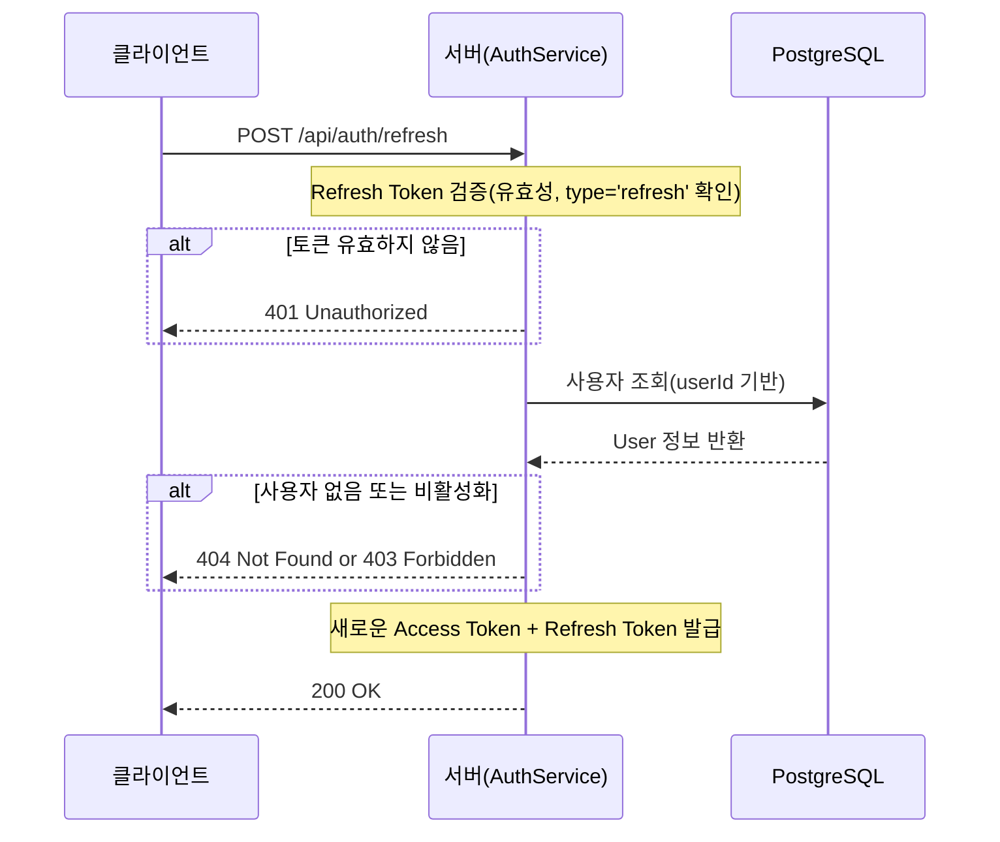

## 📋 목차

- [기술 스택 선정](#-기술-스택-선정)
- [데이터베이스 설계](#-데이터베이스-설계)
- [인증 시스템 설계](#-인증-시스템-설계)
- [주요 기술적 의사결정](#-주요-기술적-의사결정)
- [트러블슈팅](#-트러블슈팅)
- [다음 단계](#-다음-단계)

---

## 🛠 기술 스택 선정

### 핵심 기술 스택

| 카테고리 | 기술 |
|---------|------|
| **Framework** | Spring Boot 3.5.9 |
| **Reactive** | Spring WebFlux |
| **Database** | PostgreSQL 15 |
| **DB Driver** | R2DBC PostgreSQL |
| **Security** | Spring Security |
| **Password** | Argon2 |
| **JWT** | jjwt 0.11.5 |
| **Config** | Jasypt |

### WebFlux를 선택한 이유

크롤링 시스템의 특성상 **여러 플랫폼을 동시에 조회**하는 상황이 많기 때문에

- 네이버, 쿠팡, 지마켓을 **병렬로 크롤링**할 수 있으며
- 크롤링 **응답 대기 중 다른 작업 처리**가 가능한 

비동기/논블로킹 프레임워크인 **Spring WebFlux**를 사용하는 방향으로 수정했다.

---

## 🗄 데이터베이스 설계

### 주요 테이블

#### users (사용자 정보)

| 컬럼 | 타입 | 설명 |
|------|------|------|
| user_id | UUID | Primary Key (보안 강화) |
| email | VARCHAR(100) | 이메일 (UNIQUE) |
| passwd | VARCHAR(255) | Argon2 해시 |
| nickname | VARCHAR(50) | 닉네임 |
| role | user_role_type | ENUM (ROLE_USER, ROLE_ADMIN) |
| is_active | BOOLEAN | 계정 활성화 상태 |

**설계 포인트**:
- `UUID` 사용: 순차적 ID보다 보안성 향상, 분산 환경 대비
- `user_role_type` ENUM: DB 레벨 타입 안전성 확보
- `is_active`: 소프트 삭제 패턴 (실제 삭제하지 않고 비활성화)

#### keyword_monitoring (키워드 모니터링)

| 컬럼 | 타입 | 설명 |
|------|------|------|
| monitor_id | BIGSERIAL | Primary Key |
| user_id | UUID | Foreign Key → users |
| keyword | VARCHAR(100) | 검색 키워드 |
| platform | platform_type | ENUM (NAVER, COUPANG, GMARKET, ALL) |
| max_results | INTEGER | 검색 결과 수 제한 (기본 5) |
| target_price | DECIMAL(10,2) | 목표 가격 |
| alert_enabled | BOOLEAN | 알림 활성화 여부 |
| alert_status | noti_type | 알림 타입 (TARGET_REACHED, PRICE_DROP, ALL) |

**설계 포인트**:
- 키워드 기반: URL이 아닌 키워드로 여러 상품 동시 추적
- 플랫폼 선택: 특정 플랫폼 또는 전체 플랫폼 검색 가능
- 알림 세분화: 목표가 도달, 가격 하락 등 상황별 알림

#### search_snapshots (검색 스냅샷)

| 컬럼 | 타입 | 설명 |
|------|------|------|
| snapshot_id | BIGSERIAL | Primary Key |
| monitor_id | BIGINT | Foreign Key → keyword_monitoring |
| product_name | VARCHAR(255) | 상품명 |
| product_url | TEXT | 상품 URL |
| current_price | DECIMAL(10,2) | 현재 가격 |
| stock_status | stock_type | 재고 상태 (IN_STOCK, OUT_OF_STOCK 등) |
| crawled_date | TIMESTAMP | 크롤링 시각 |

**인덱스 전략**:
```sql
CREATE INDEX idx_snapshots_monitor_crawled 
    ON search_snapshots(monitor_id, crawled_date DESC);
```
- 시계열 조회 최적화: 특정 모니터링의 **최신 데이터부터 조회**

---

## 🔐 인증 시스템 설계

### 1. Argon2 PasswordEncoder 선택

> Argon2 계열은 2015년 열린 비밀번호 해싱 경연 대회(Password Hashing Competition)의 우승 알고리즘이다.<br>
> RFC 9106에서는 매개변수를 선택할 때 “Argon2id를 기본적으로 사용하라”는 지침을 제공한다.<br>
> OWASP도 비밀번호 저장 지침에서 Argon2id 를 권장한다.<br><br>
> *IT위키 - Argon2id에 대한 내용 일부*

**선택 이유**:
1. **2015 Password Hashing Competition 우승** 알고리즘
2. **GPU/ASIC 공격에 강력한 저항성**
3. **메모리 집약적 설계**로 병렬 공격 방어

위와 같은 내용을 바탕으로 Password Encode 방식을 Argon2로 변경하였다.

### 2. JWT 토큰 전략

#### Access Token + Refresh Token

| 토큰 타입 | 유효 기간 | 용도 | Claims |
|-----------|----------|------|--------|
| **Access Token** | 2시간 | API 요청 인증 | userId, email, role, type |
| **Refresh Token** | 7일 | Access Token 갱신 | userId, type |

**설계 이유**:
- **Access Token 짧게**: 탈취 시 피해 최소화
- **Refresh Token 길게**: 사용자 편의성
- **type claim**: Access/Refresh 구분으로 잘못된 토큰 사용 방지

#### 토큰 갱신 플로우


### 3. API 엔드포인트 설계

| 엔드포인트 | 메서드 | 기능 | 인증 필요 |
|-----------|--------|------|----------|
| `/api/auth/signup` | POST | 회원가입 | ❌ |
| `/api/auth/login` | POST | 로그인 | ❌ |
| `/api/auth/refresh` | POST | 토큰 갱신 | ❌ (Refresh Token 필요) |

---

## 💡 주요 기술적 의사결정

### 1. R2DBC vs JDBC

**고민**: 완전한 리액티브 vs 성숙한 생태계

**선택**: R2DBC PostgreSQL

**이유**:
- WebFlux와의 **완전한 논블로킹 스택** 구성
- 크롤링 시스템에서 **I/O 대기 시간 활용** 중요
- 학습 목적: 최신 리액티브 기술 경험

**트레이드오프**:
- ⚠️ JDBC보다 성숙도 낮음 (**<span style="color:red">특히 ENUM 매핑 등</span>**)
- ⚠️ 일부 기능은 Custom Query 필요
- ✅ 향후 확장성과 성능에서 이점

---

### 2. PostgreSQL ENUM vs VARCHAR

**고민**: 타입 안전성 vs 유연성

**선택**: PostgreSQL ENUM 타입

**이유**:
1. **DB 레벨 제약 조건**: 잘못된 값 입력 원천 차단
2. **저장 공간 효율**: ENUM은 4바이트, VARCHAR는 가변 길이
3. **쿼리 성능**: ENUM 인덱스가 더 효율적
4. **Java Enum과 매핑**: 타입 안전성 확보

**구현 방식**:
- PostgreSQL ENUM 타입 정의
- Java Enum 클래스 생성
- R2DBC EnumCodec 등록 (SELECT용)
- Custom Query + CAST (INSERT/UPDATE용)

---

### 4. Jasypt 암호화

**적용 대상**:
- DB 비밀번호
- JWT Secret Key
- 외부 API Key (향후)

**방식**:
```properties
# 암호화 전
spring.r2dbc.password=my-password
jwt.secret=my-secret-key

# 암호화 후
spring.r2dbc.password=ENC(암호화된_값)
jwt.secret=ENC(암호화된_값)
```

**장점**:
- GitHub에 민감 정보 노출 방지
- 환경별 설정 관리 용이
- 추가 인프라 불필요 (환경 변수만 필요)

---

## 🔧 트러블슈팅

### 1. R2DBC ENUM 타입 매핑 문제

**문제**:
```
column "role" is of type user_role_type 
but expression is of type character varying
```

**원인**:
- R2DBC의 EnumCodec은 **SELECT에서만** 자동 변환
- INSERT/UPDATE에서는 Spring Data R2DBC가 ENUM을 인식하지 못함

**해결 과정**:

1. **1차 시도**: EnumCodec만 등록 → 실패
2. **2차 시도**: Converter 추가 → 여전히 실패
3. **최종 해결**: Custom Query + CAST

**핵심 패턴**:
```sql
-- INSERT/UPDATE 시 명시적 타입 캐스팅
CAST(:#{#user.role.name()} AS user_role_type)
```

**교훈**:

WebFlux 환경에서 리액티브 데이터베이스 드라이버로 R2DBC를 선택했지만, 개발 과정에서 PostgreSQL ENUM 타입 매핑 등 여러 한계를 경험했다.
<br>
이를 통해 **사용하려는 기술 스택에 대한 사전 조사가 미흡했다**는 것을 다시 한 번 알게되었고,
<br><br>
앞으로는 새로운 기술 도입 전:
> - 공식 문서 + 이슈 트래커 + 커뮤니티 피드백 검토
> - 프로젝트 목표 달성에 적합한지 검증

을 진행할 필요성을 느끼게 되었다.


### 2. Argon2 구현체 선택

**선택지**:
1. **argon2-jvm** (네이티브 바이너리)
2. **BouncyCastle** (순수 Java)

**비교**:

| 항목 | argon2-jvm | BouncyCastle |
|------|-----------|--------------|
| 성능 | 빠름 (2~3배) | 느림 |
| 플랫폼 독립성 | ❌ | ✅ |
| Spring 통합 | 일반 | ✅ 공식 지원 |
| 배포 복잡도 | 높음 | 낮음 |

**선택**: BouncyCastle

**이유**:
1. **Write Once, Run Anywhere** 원칙 준수
2. **Spring Security 공식 지원**
3. **성능 이슈 완화 방안**:
   - 회원가입/로그인은 빈도가 낮음
   - 실제 병목은 DB/네트워크
   - 수평 확장으로 처리량 증가 가능

**성능 테스트**:
```
해싱 시간: ~200ms (BouncyCastle) vs ~80ms (argon2-jvm)
로그인 전체 응답 시간: ~300ms (DB 조회 포함)

→ 해싱 성능이 전체 응답에 미치는 영향: 미미
```
---

## 📊 구현 결과

### API 테스트 결과

**회원가입** (Insomnia):
```http
POST /api/auth/signup
Content-Type: application/json

{
  "email": "test@pricewatch.com",
  "password": "password123",
  "nickname": "테스트유저"
}

→ 201 Created
{
  "result": true,
  "message": "회원가입이 완료되었습니다.",
  "data": { ... }
}
```

**로그인**:
```http
POST /api/auth/login
Content-Type: application/json

{
  "email": "test@pricewatch.com",
  "password": "password123"
}

→ 200 OK (응답 시간: ~300ms)
```

**토큰 갱신**:
```http
POST /api/auth/refresh
Content-Type: application/json

{
  "refreshToken": "jwt..."
}

→ 200 OK
```

### 에러 처리 테스트

| 케이스 | 응답 코드 |
|--------|----------|
| 이메일 중복 | 409 Conflict |
| 잘못된 비밀번호 | 401 Unauthorized |
| Validation 실패 | 400 Bad Request |
| 만료된 토큰 | 401 Unauthorized |

---

## 🎯 다음 단계

### Phase 1: MVP (현재)

- [x] 프로젝트 기획 및 DB 설계
- [x] 보안 설계 (UUID, 권한 검증)
- [x] Spring Boot 프로젝트 셋업
- [x] 사용자 인증/인가 (JWT)
- [ ] 키워드 모니터링 CRUD API
- [ ] 네이버 쇼핑 크롤링 구현
- [ ] 스케줄러 구현 (1시간 주기)
- [ ] 목표가 도달 알림 (이메일)

### Phase 2: 멀티 플랫폼

- [ ] 쿠팡 크롤링 구현
- [ ] 지마켓 크롤링 구현
- [ ] 플랫폼 통합 검색 및 가격 병합
- [ ] 알림 채널 확장 (Slack, Discord)

### Phase 3: AI 분석

- [ ] Claude API 연동
- [ ] 가격 트렌드 분석 기능
- [ ] 최적 구매 시점 추천
- [ ] 경쟁 상품 비교 분석

### Phase 4: 고도화

- [ ] 프론트엔드 개발 (React or Thymeleaf)
- [ ] 가격 그래프 시각화
- [ ] 사용자 대시보드
- [ ] 모바일 앱 (선택사항)

### Phase 5: 운영 및 확장

- [ ] Oracle Cloud 배포
- [ ] CI/CD 파이프라인 구축
- [ ] 모니터링 및 로깅 시스템
- [ ] 성능 최적화
- [ ] 사용자 피드백 반영

---

## 📚 참고 자료

- [Spring WebFlux Documentation](https://docs.spring.io/spring-framework/reference/web/webflux.html)
- [R2DBC PostgreSQL](https://github.com/pgjdbc/r2dbc-postgresql)
- [Argon2 Password Hashing](https://github.com/P-H-C/phc-winner-argon2)
- [Spring Security Reference](https://docs.spring.io/spring-security/reference/)
- [JWT Best Practices RFC 8725](https://datatracker.ietf.org/doc/html/rfc8725)

---